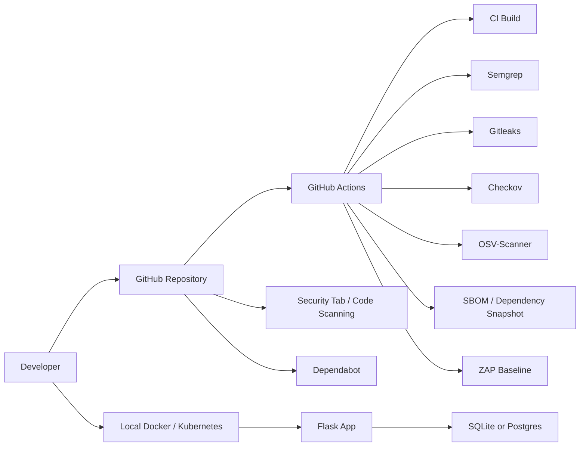
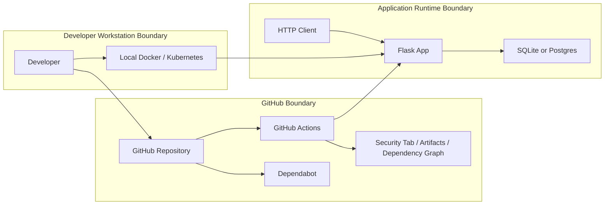

# Threat Model

## Scope

This threat model covers the starter-kit repository, the Python Flask example, and the CI security pipeline definitions around it:

- Flask app in `examples/python-flask/app.py`
- local Docker and Docker Compose execution
- Kubernetes manifests in `examples/python-flask/k8s/`
- GitHub Actions workflows for CI, SAST, secrets, IaC, SCA, SBOM, and DAST
- GitLab CI definitions for validate, build, and core security scans

Out of scope:

- enterprise identity systems
- cloud infrastructure outside GitHub-hosted runners
- production-grade external users or customer data

## Security Goals

The main goals for this repo are:

1. prevent obviously unsafe code, secrets, and infrastructure from being merged unnoticed
2. protect local and CI build paths from simple tampering or accidental exposure
3. document where the learning app is intentionally weak so findings are interpreted correctly
4. make supply-chain and runtime risks visible through GitHub-native workflows and artifacts

## System Overview

## Assets

Important assets in this repo:

- application source code
- GitHub Actions workflow definitions
- GitLab CI pipeline definition
- dependency definitions in `examples/python-flask/requirements.txt`
- SBOM artifact and dependency graph data
- SARIF-based findings in GitHub code scanning
- Kubernetes secrets and database connection settings
- notes stored in SQLite or Postgres

## Trust Boundaries

Main trust boundaries:

- developer workstation to GitHub
- GitHub repository to GitHub-hosted runners
- public HTTP client to Flask app
- Flask app to database
- repository code to third-party GitHub Actions and container images
- local Kubernetes cluster to container images and secrets

## Trust Boundaries Diagram

## Entry Points

Primary entry points:

- `GET /`
- `POST /notes`
- `GET /api/notes`
- `GET /healthz`
- pull requests and pushes to `main`
- dependency updates from Dependabot
- workflow execution on GitHub-hosted runners

## Threats

| Area | Threat | Why it matters | Current controls | Remaining gap |
| --- | --- | --- | --- | --- |
| App | untrusted input rendered into HTML | could become XSS or template injection | Semgrep, ZAP baseline | app still contains intentionally weak patterns for learning |
| App | weak auth/session model | there is no authentication boundary at all | out of scope for current app | add auth if the app evolves beyond demo use |
| App | database tampering or data loss | notes are stored without user separation | container/runtime isolation, local-only default use | no authorization, no audit trail |
| Secrets | accidental commit of keys or tokens | secrets in git are hard to recover from | Gitleaks, `SECURITY.md` | local scratch files can still be created carelessly |
| CI/CD | malicious or risky workflow change | workflows control scanners and build behavior | CODEOWNERS, branch protection guidance, Semgrep on workflows via repo scans | branch protection still depends on GitHub settings |
| Supply chain | vulnerable dependency pulled into build | exploitable package risk in app or tools | Dependabot, OSV-Scanner, SBOM | no pinning strategy beyond current manifests |
| Third-party actions | compromised GitHub Action or container | inherited risk from external actions | explicit workflow files, review visibility | several actions are version-tag based, not commit pinned |
| IaC | insecure Kubernetes defaults | privilege or exposure issues at runtime | Checkov, Semgrep | manifests still intentionally show findings for training |
| DAST target | unsafe live behavior missed by static scanners | runtime headers and HTTP behavior matter | ZAP baseline | DAST is unauthenticated and passive-only |
| Reporting | security findings ignored or misunderstood | signals lose value if nobody triages them | GitHub Security tab, artifacts, README, SECURITY.md | no centralized triage workflow like DefectDojo |

## Existing Controls

Controls already present in the repo:

- CI build validation
- Semgrep static analysis
- Gitleaks secret scanning
- Checkov Kubernetes scanning
- OSV dependency vulnerability scanning
- SBOM generation and dependency snapshot submission
- ZAP baseline DAST
- Dependabot updates
- GitLab CI baseline jobs for validate, build, and core scans
- `SECURITY.md`
- `.github/CODEOWNERS`

## Highest-Priority Risks

The highest-priority risks for this repo today are:

1. insecure demo code being mistaken for production-ready code
2. workflow or dependency trust issues in the software supply chain
3. missing GitHub settings controls such as enforced branch protection
4. runtime weaknesses that baseline DAST can see but the team might not review

## Recommended Next Steps

1. enable branch protection and require key checks before merge
2. pin third-party GitHub Actions to commit SHAs where practical
3. add a short triage process for reviewing Security tab alerts and DAST artifacts
4. decide whether to fix or explicitly document the intentionally vulnerable demo findings
5. add a lightweight architecture or data-flow diagram if the app grows

## Assumptions

- this repository is for learning, not production service delivery
- no sensitive customer data should be stored in the demo app
- GitHub-hosted runners are acceptable for the current exercises
- contributors are expected to use pull requests rather than pushing risky changes directly to `main`
